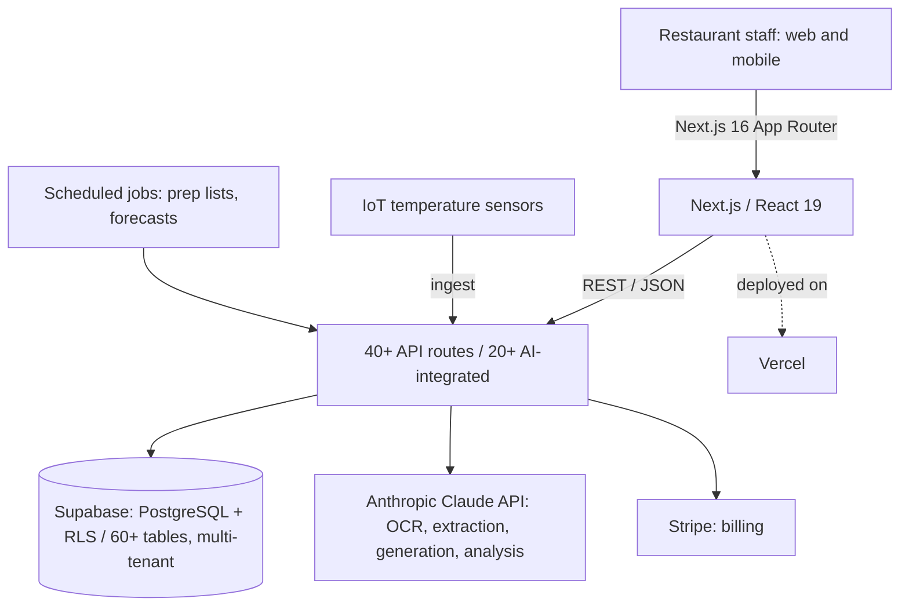
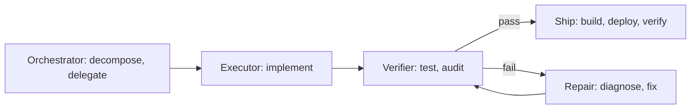

# RiveHub — Architecture

> **RiveHub** is a production, multi-tenant SaaS that automates **MAPAQ regulatory compliance** for Quebec restaurants. I designed, built and operate it solo.
>
> The product source is private (commercial). This repository is a **high-level system-design writeup**, plus the AI-assisted development methodology behind it.

Product: [rivehub.com](https://rivehub.com)

## What it does

Quebec restaurants must satisfy MAPAQ food-safety rules (HACCP logs, traceability, temperature records, labelling). RiveHub turns that manual, paper-driven burden into automation:

- **AI document intake** : receipt & invoice OCR/extraction; menu extraction from URLs or files
- **HACCP automation** : builder, checklists, photo capture, audit-ready records
- **24/7 IoT temperature monitoring** : sensor ingestion plus threshold alerts
- **Operational AI** : prep-list generation, demand forecasting, menu engineering, best-before labels, content generation
- **i18n** : 59 locale catalogs for multilingual kitchen brigades

## System architecture

- **Multi-tenant isolation** enforced at the data layer with **PostgreSQL Row-Level Security** across 60+ tables, so every query is tenant-scoped by default.
- **40+ API routes**, of which **20+ are AI-integrated** (document extraction, menu analysis, forecasting, content generation, notes analysis).

## AI subsystem (production, not demos)

- **Structured extraction** : receipts, invoices and menus parsed into typed, validated records (structured outputs / tool use).
- **Cost and latency control** : prompt caching and batching where the workload allows.
- **Safety** : input validation and prompt-injection defense on user-facing AI endpoints (kept high-level by design).
- **Provider strategy** : Anthropic Claude primary, with graceful degradation.

## Built by an agent fleet

Developed and operated with a **fleet of Claude Code agents** I built, an orchestration harness that turns one developer into a team:

Topology patterns in rotation: **Solver + Verifier**, **Pipeline**, **Audit Fleet**, covering development, QA, deployment and incident response under a contract-based coordination protocol.

## Stack

| Layer | Tech |
|---|---|
| Frontend | Next.js 16 (App Router), React 19, TypeScript |
| Data | Supabase (PostgreSQL + Row-Level Security), 60+ tables |
| AI | Anthropic Claude API, MCP, multi-agent orchestration |
| Payments | Stripe |
| i18n | next-intl (59 locales) |
| Infra | Vercel, CI/CD, Git |

---

*By [Nassim Saighi, MD](https://github.com/NotFormally), physician + applied-AI builder. Source private; happy to walk through the system on request.*
